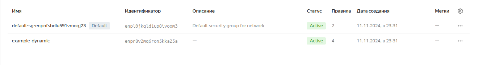
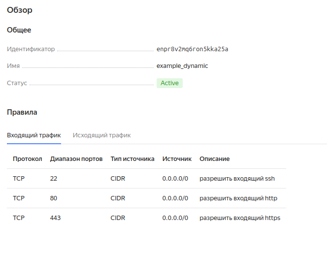
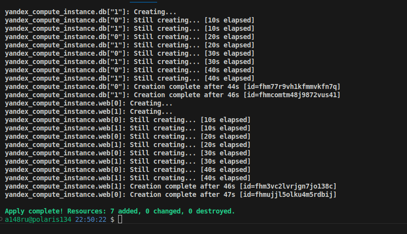

## Решение Домашнего задания "Управляющие конструкции в коде Terraform" - a148aa@yandex.ru

#### Задание 1





#### Задание 2

##### 2.1

```rb
resource "yandex_compute_instance" "web" {
  count = 2
  name = "web-${count.index+1}"
```


```
network_interface {
    ...
    security_group_ids = [yandex_vpc_security_group.example.id]
  }
```
##### 2.2

```rb
variable "each_vm" {
  type = list(object({  
    vm_name=string,
    cpu=number,
    ram=number,
    disk_volume=number,
    c_fract=number
    }))
  default = [ {
      vm_name = "main",
      cpu = 4,
      ram = 4,
      disk_volume = 10,
      c_fract = 20
    },
    {
      cpu = 2
      disk_volume = 16
      ram = 2
      vm_name = "replica",
      c_fract = 20
    } ]
```

```rb
locals {
    vms_ssh_root_key = sensitive(file("~/.ssh/id_ed25519.pub"))
}
```

```rb
resource "yandex_compute_instance" "db" {
    for_each = {
        0 = var.each_vm.0
        1 = var.each_vm.1
    }
    name = "${each.value.vm_name}"
    ...

  resources {
    cores         = each.value.cpu
    memory        = each.value.ram
    core_fraction = each.value.c_fract
    }

  boot_disk {
    initialize_params {
      ...
      size = each.value.disk_volume
    }
  }
  ...
```


